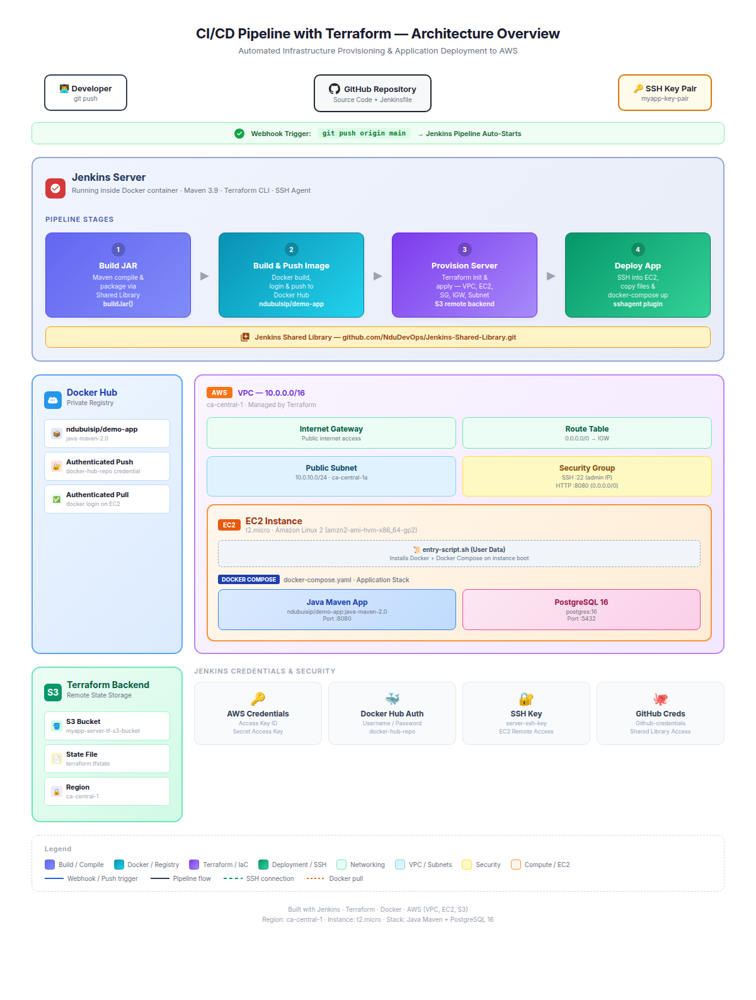

# CI/CD Pipeline with Terraform — Automated Infrastructure Provisioning & Deployment

An end-to-end CI/CD pipeline that automates the build, infrastructure provisioning, and deployment of a Java Maven application to AWS EC2 using Jenkins, Terraform, and Docker. A single `git push` triggers the entire workflow — from compiling the application to spinning up cloud infrastructure and deploying containerized services.

---

## Architecture Diagram

<p align="center">
  
</p>

> The full interactive version is available in [architecture-diagram.html](architecture-diagram.html) — open it in any browser for the best viewing experience.

---

## Table of Contents

1. [Overview](#overview)
2. [Technology Stack](#technology-stack)
3. [Project Structure](#project-structure)
4. [Pipeline Stages](#pipeline-stages)
5. [Infrastructure as Code](#infrastructure-as-code)
6. [Prerequisites](#prerequisites)
7. [Configuration & Setup](#configuration--setup)
8. [How It Works](#how-it-works)
9. [Jenkins Console Output](#jenkins-console-output-condensed)
10. [Demo Steps Executed](#demo-steps-executed)

---

## Overview

This project demonstrates a fully automated CI/CD workflow in which a Java Spring Boot application is built with Maven, containerized with Docker, and deployed to a dynamically provisioned AWS EC2 instance — all orchestrated by a Jenkins pipeline with Terraform handling infrastructure provisioning. The Terraform state is stored remotely in an S3 backend, ensuring consistent and collaborative infrastructure management.

The entire deployment lifecycle is triggered by a single push to the GitHub repository.

---

## Technology Stack

| Category                | Technology                                      |
|-------------------------|-------------------------------------------------|
| **Application**         | Java 8, Spring Boot 2.3, Maven                  |
| **Containerization**    | Docker, Docker Compose                          |
| **CI/CD**               | Jenkins (Containerized), Jenkins Shared Library  |
| **Infrastructure**      | Terraform (IaC), AWS (VPC, EC2, S3)             |
| **Container Registry**  | Docker Hub (Private Repository)                 |
| **Database**            | PostgreSQL 16                                   |
| **OS (EC2)**            | Amazon Linux 2 (AMI: amzn2-ami-hvm-x86_64-gp2) |
| **Version Control**     | Git, GitHub                                     |

---

## Project Structure

```
java-maven-app-terraform-cicd/
├── Jenkinsfile                  # Declarative pipeline with 4 stages
├── Dockerfile                   # Multi-stage Docker image (Amazon Corretto JRE 8)
├── docker-compose.yaml          # Service definitions (app + PostgreSQL)
├── server-cmds.sh               # Remote deployment script (Docker login & compose up)
├── pom.xml                      # Maven build configuration (Spring Boot)
├── src/
│   └── main/
│       ├── java/com/example/
│       │   └── Application.java # Spring Boot entry point
│       └── resources/static/
│           └── index.html       # Static landing page
└── terraform/
    ├── main.tf                  # AWS resource definitions (VPC, EC2, SG, IGW)
    ├── variables.tf             # Parameterized Terraform variables
    └── entry-script.sh          # EC2 user data — installs Docker & Docker Compose
```

---

## Pipeline Stages

The Jenkinsfile defines a four-stage pipeline that leverages a [Jenkins Shared Library](https://github.com/NduDevOps/Jenkins-Shared-Library.git) for reusable build and Docker functions.

### Stage 1 — Build Application
Compiles the Java application into a JAR artifact using Maven 3.9 via the shared library `buildJar()` function.

### Stage 2 — Build & Push Docker Image
Builds a Docker image from the JAR artifact, authenticates with Docker Hub, and pushes the image (`ndubuisip/demo-app:java-maven-2.0`) to a private repository using shared library functions `buildImage()`, `dockerLogin()`, and `dockerPush()`.

### Stage 3 — Provision Server (Terraform)
Initializes Terraform with an S3 remote backend and applies the infrastructure configuration to provision a full AWS environment: VPC, subnet, internet gateway, route table, security group, and an EC2 instance. AWS credentials are injected securely via Jenkins credentials. The EC2 public IP is captured as a pipeline variable for the next stage.

### Stage 4 — Deploy Application
Waits 90 seconds for the EC2 instance to initialize, then uses SSH (via the `sshagent` plugin) to securely copy `server-cmds.sh` and `docker-compose.yaml` to the remote server. The deployment script authenticates with Docker Hub and runs `docker-compose up` to start the application and database containers.

---

## Infrastructure as Code

Terraform provisions the following AWS resources:

| Resource                     | Description                                               |
|------------------------------|-----------------------------------------------------------|
| **VPC**                      | Custom VPC (`10.0.0.0/16`)                                |
| **Subnet**                   | Public subnet (`10.0.10.0/24`) in `ca-central-1a`        |
| **Internet Gateway**         | Enables internet access for the EC2 instance              |
| **Route Table**              | Default route table with `0.0.0.0/0` → IGW               |
| **Security Group**           | SSH (22) from admin/Jenkins IPs; HTTP (8080) open to all  |
| **EC2 Instance**             | `t2.micro` with Amazon Linux 2 AMI                        |
| **S3 Backend**               | Remote state storage (`myapp-server-tf-s3-bucket`)        |

The EC2 instance is bootstrapped via `entry-script.sh` (user data), which installs Docker and Docker Compose on first boot.

---

## Prerequisites

- **Jenkins** — running in a Docker container with the following installed/configured:
  - Terraform CLI
  - Maven 3.9
  - SSH Agent plugin
  - Docker pipeline plugin
- **AWS Account** — with an IAM user that has EC2, VPC, and S3 permissions
- **Docker Hub Account** — with a private repository
- **SSH Key Pair** — created for EC2 access (`myapp-key-pair`)
- **S3 Bucket** — `myapp-server-tf-s3-bucket` in `ca-central-1` for Terraform state

---

## Configuration & Setup

### 1. Jenkins Credentials

Configure the following credentials in Jenkins (Manage Jenkins → Credentials):

| Credential ID                    | Type             | Purpose                              |
|----------------------------------|------------------|--------------------------------------|
| `jenkins_aws_access_key_id`      | Secret text      | AWS access key for Terraform         |
| `jenkins-aws_secret_access_key`  | Secret text      | AWS secret key for Terraform         |
| `docker-hub-repo`                | Username/Password| Docker Hub authentication            |
| `server-ssh-key`                 | SSH Username/Key | SSH access to provisioned EC2        |
| `Github-credentials`             | Username/Password| Access to Jenkins Shared Library repo|

### 2. Jenkins Shared Library

The pipeline depends on a shared library hosted at:
`https://github.com/NduDevOps/Jenkins-Shared-Library.git`

This library provides the following functions: `buildJar()`, `buildImage()`, `dockerLogin()`, and `dockerPush()`.

### 3. Terraform Variables

Variables can be overridden via environment variables (prefixed with `TF_VAR_`) or by editing `terraform/variables.tf`:

| Variable             | Default              | Description                     |
|----------------------|----------------------|---------------------------------|
| `vpc_cidr_block`     | `10.0.0.0/16`       | VPC CIDR range                  |
| `subnet_cidr_block`  | `10.0.10.0/24`      | Subnet CIDR range               |
| `avail_zone`         | `ca-central-1a`     | AWS Availability Zone           |
| `env_prefix`         | `dev`                | Environment tag prefix          |
| `instance_type`      | `t2.micro`           | EC2 instance type               |
| `region`             | `ca-central-1`       | AWS region                      |

---

## How It Works

```
Developer pushes code to GitHub
        │
        ▼
Jenkins webhook triggers the pipeline
        │
        ▼
Stage 1: Maven builds the JAR artifact
        │
        ▼
Stage 2: Docker image is built, tagged, and pushed to Docker Hub
        │
        ▼
Stage 3: Terraform provisions VPC, Subnet, IGW, SG, and EC2 on AWS
        │
        ▼
Stage 4: Jenkins SSHs into the new EC2 instance,
         copies deployment files, runs docker-compose
        │
        ▼
Application is live at http://<EC2_PUBLIC_IP>:8080
```

---

## Jenkins Console Output (Condensed)

Below is a condensed version of the successful Jenkins pipeline execution, highlighting the key milestones from each stage.

<details>
<summary><strong>Stage 1 — Build Application (Maven)</strong></summary>

```
[Pipeline] { (build app)
building application jar...
build the application for branch jenkinsfile-sshagent
+ mvn package

[INFO] ---------------------< com.example:java-maven-app >---------------------
[INFO] Building java-maven-app 1.1.0-SNAPSHOT
[INFO] --------------------------------[ jar ]---------------------------------
[INFO] --- resources:3.3.1:resources (default-resources) @ java-maven-app ---
[INFO] Copying 1 resource from src/main/resources to target/classes
[INFO] --- compiler:3.6.0:compile (default-compile) @ java-maven-app ---
[INFO] Nothing to compile - all classes are up to date
[INFO] --- jar:3.4.1:jar (default-jar) @ java-maven-app ---
[INFO] --- spring-boot:2.3.5.RELEASE:repackage (default) @ java-maven-app ---
[INFO] Replacing main artifact with repackaged archive
[INFO] ------------------------------------------------------------------------
[INFO] BUILD SUCCESS
[INFO] ------------------------------------------------------------------------
[INFO] Total time:  1.880 s
[INFO] Finished at: 2026-03-21T18:57:30Z
```

</details>

<details>
<summary><strong>Stage 2 — Build & Push Docker Image</strong></summary>

```
[Pipeline] { (build image)
building the docker image...
+ docker build -t ndubuisip/demo-app:java-maven-2.0 .

#5 [1/3] FROM docker.io/library/amazoncorretto:8-alpine3.17-jre
#7 [2/3] COPY ./target/java-maven-app-*.jar /usr/app/
#8 [3/3] WORKDIR /usr/app
#9 naming to docker.io/ndubuisip/demo-app:java-maven-2.0 done

+ docker login -u ndubuisip --password-stdin
Login Succeeded

+ docker push ndubuisip/demo-app:java-maven-2.0
The push refers to repository [docker.io/ndubuisip/demo-app]
java-maven-2.0: digest: sha256:437611ed63fbd4d16d00239307784441b2a40b04a3a504422e1ab649aa5b05f4 size: 1158
```

</details>

<details>
<summary><strong>Stage 3 — Provision Server (Terraform)</strong></summary>

```
[Pipeline] { (provision server)
+ terraform init -input=false -force-copy

Terraform has been successfully initialized!

+ terraform apply --auto-approve

Terraform will perform the following actions:

  # aws_vpc.myapp-vpc will be created             → 10.0.0.0/16
  # aws_subnet.myapp-subnet-1 will be created     → 10.0.10.0/24 (ca-central-1a)
  # aws_internet_gateway.myapp-igw will be created
  # aws_default_route_table.main-rtb will be created → 0.0.0.0/0 → IGW
  # aws_default_security_group.default-sg will be created
      → Ingress: SSH (22) from 74.88.44.204/32, 143.110.218.223/32
      → Ingress: HTTP (8080) from 0.0.0.0/0
      → Egress:  All traffic to 0.0.0.0/0
  # aws_instance.myapp-server will be created
      → AMI: ami-09155def8f3f1a9ef (Amazon Linux 2)
      → Instance type: t2.micro
      → Key pair: myapp-key-pair

Plan: 6 to add, 0 to change, 0 to destroy.

aws_vpc.myapp-vpc: Creation complete         [id=vpc-0cd61855db1e42f23]
aws_internet_gateway.myapp-igw: Created      [id=igw-03634a55e0f1b67a3]
aws_subnet.myapp-subnet-1: Created           [id=subnet-0642854bcbbf7e9af]
aws_default_route_table.main-rtb: Created    [id=rtb-08be5ceb726e7d60f]
aws_default_security_group.default-sg: Created [id=sg-0fa5e0a6ae549fb8b]
aws_instance.myapp-server: Created           [id=i-04adabc5acf6025d8]

Apply complete! Resources: 6 added, 0 changed, 0 destroyed.

Outputs:
ec2_public_ip = "35.183.18.35"
```

</details>

<details>
<summary><strong>Stage 4 — Deploy Application (SSH + Docker Compose)</strong></summary>

```
[Pipeline] { (deploy)
waiting for EC2 server to initialize
Sleeping for 1 min 30 sec
deploying docker image to EC2...
"35.183.18.35"

[ssh-agent] Using credentials ec2-user
Identity added: private_key

+ scp -o StrictHostKeyChecking=no server-cmds.sh ec2-user@35.183.18.35:/home/ec2-user
+ scp -o StrictHostKeyChecking=no docker-compose.yaml ec2-user@35.183.18.35:/home/ec2-user
+ ssh -o StrictHostKeyChecking=no ec2-user@35.183.18.35 bash ./server-cmds.sh ndubuisip/demo-app:java-maven-2.0 ndubuisip ****

Login Succeeded

 Image postgres:16 Pulled
 Image ndubuisip/demo-app:java-maven-2.0 Pulled

 Network ec2-user_default Created
 Container ec2-user-java-maven-app-1 Created
 Container ec2-user-postgres-1 Created
 Container ec2-user-postgres-1 Started
 Container ec2-user-java-maven-app-1 Started
success

[ssh-agent] Stopped.
```

</details>

<details>
<summary><strong>Pipeline Result</strong></summary>

```
Finished: SUCCESS
```

</details>

---

## Demo Steps Executed

- [x] Created SSH key pair for EC2 instance
- [x] Created credentials in Jenkins (AWS, Docker Hub, SSH, GitHub)
- [x] Installed Terraform inside the Jenkins container
- [x] Created Terraform configuration files to provision an EC2 server (VPC, Subnet, IGW, SG)
- [x] Created `entry-script.sh` to install Docker, Docker Compose, and start containers
- [x] Adjusted Jenkinsfile to include provision and deployment stages
- [x] Included Docker login to pull images from private Docker Hub repository
- [x] Executed the full CI/CD pipeline successfully

---

## Repository

**GitHub:** [NduDevOps/java-maven-app-terraform-cicd](https://github.com/NduDevOps/java-maven-app-terraform-cicd)

---

## License

This project is intended for educational and demonstration purposes.
